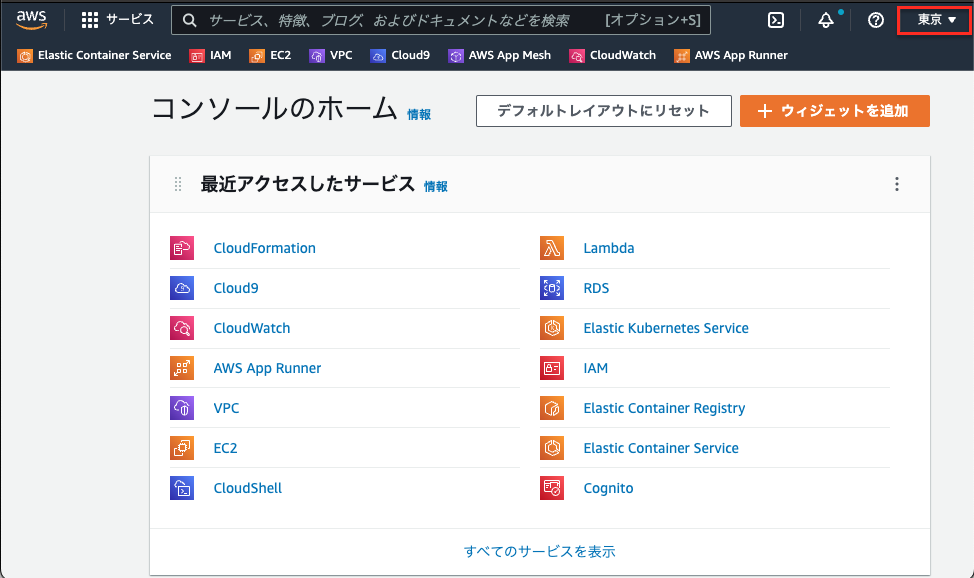
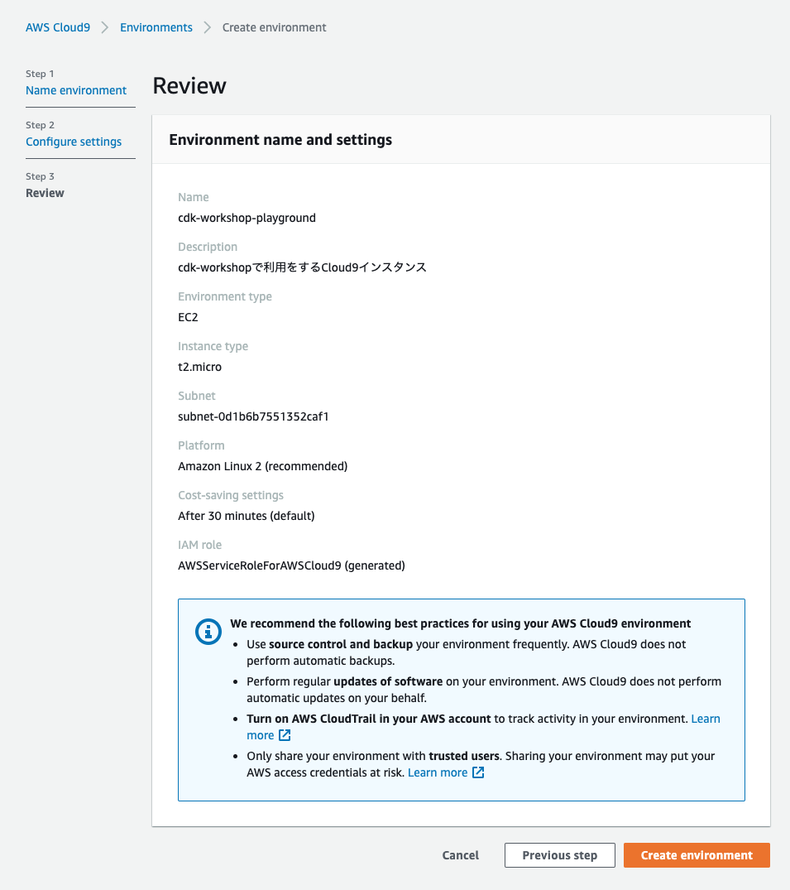

# CDKを動かす環境である「Cloud9」の構築

## 動作検証済みの各ソフトウェアバージョン

| ソフトウェア | バージョン |
| ------------ | ---------- |
| Node.js      | v16.17.0   |
| CDK          | 2.39.1     |
| AWS CLI      | 1.19.112   |

## 前提事項

- AWSアカウントを所有していること
- AdministratorAccessポリシー相当のIAMユーザーもしくはIAMロールで作業可能なこと
- 作業は東京リージョン(ap-northeast-1)で実施すること（下図参照）

## Cloud9の作成

AWS Cloud9(以降、Cloud9）インスタンスを作成します。

1. AWSマネジメントコンソール上部の [サービス] タブより [Cloud9] を選択します。
2. Cloud9ダッシュボードの左側ナビゲーションメニューから [Account environments] を選択し、[Create environment] ボタンを押します。
3. Step1 [Name environment] では、次のように各項目を入力後、 [Next step] ボタンを押します。

| 項目名      | 値                                         |
| ----------- | ------------------------------------------ |
| Name        | cdk-workshop-playground                    |
| Description | cdk-workshopで利用をするCloud9インスタンス |

4. Step2 [Configure settings] では、次のように各項目を入力・選択後、 [Next step] ボタンを押します。
ネットワークVPC及びサブネットはデフォルトのものを選択してください（デフォルトVPCが存在しない場合、インターネットに接続可能なVPCとサブネットを選択してください）。

| 項目名              | 値                                                       |
| ------------------- | -------------------------------------------------------- |
| Environment type    | Create a new EC2 instance for environment(direct access) |
| Instance type       | t2.micro (1 GiB RAM + 1 vCPU)                            |
| Platform            | Amazon Linux2 (recommended)                              |
| Cost-saving setting | After 30 minutes(default)                                |
| Network(VPC)        | vpc-xxxxxxx(default) ※インターネットに接続可能なVPC      |
| Subnet              | subnet-xxxxxxx                                           | Default in ap-northeast-1a |

5. [Review] にて入力内容を確認し、 [Create environment] ボタンを押します。

6. 以下のようにCloud9コンソールが利用可能であることを確認してください。

以上でCloud9の作成完了です。
以降は、CDKのコマンドを実行する際はCloud9の画面下部にあるターミナルから実施をします。