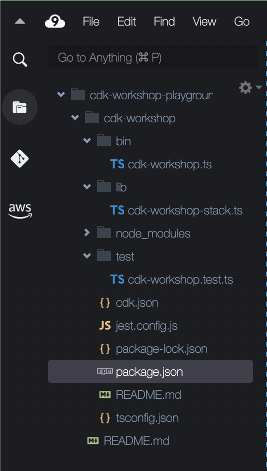

+++
title = "プロジェクト構造"
weight = 300
+++

## IDEを開く

使い慣れたIDEでプロジェクトを開いてみましょう。

> Cloud9 を使用する場合は、すでにIDEの画面で操作を行っています。

> VSCodeを使用する場合は、 `code .` コマンドをプロジェクトディレクトリ内で実行すれば簡単に開けます。

## プロジェクトディレクトリを確認する

以下のようなディレクトリ構成が確認できます。



- **`lib/cdk-workshop-stack.ts`** CDKアプリケーションのメインスタックが定義されます。
  今回のワークショップではこのファイルを主に修正します。
- `bin/cdk-workshop.ts` CDKアプリケーションのエントリポイントです。
  `lib/cdk-workshop-stack.ts` で定義されたスタックをロードします。
- `package.json` npmモジュールのマニフェストです。
  アプリの名前、バージョン、依存関係、"watch" や "build" 用のビルドスクリプトなどの情報が含まれます（`package-lock.json` はnpmによって管理されます）
- `cdk.json` アプリの実行方法をツールキットに指示させるためのファイルです。
  今回の場合は、 `"npx ts-node bin/cdk-workshop.ts"` です。
- `tsconfig.json` プロジェクトの [TypeScript設定](https://www.typescriptlang.org/docs/handbook/tsconfig-json.html) です。
- `.gitignore`, `.npmignore` Gitとnpm用のファイルです。
  ソースコードの管理に含める/除外するファイルと、パッケージマネージャーへの公開用設定が含まれています。
- `node_modules` npmによって管理され、プロジェクトのすべての依存関係が含まれます。

## アプリのエントリポイント

`bin/cdk-workshop.ts`を簡単に見てみましょう。

```js
#!/usr/bin/env node
import * as cdk from 'aws-cdk-lib';
import { CdkWorkshopStack } from '../lib/cdk-workshop-stack';

const app = new cdk.App();
new CdkWorkshopStack(app, 'CdkWorkshopStack');
```

このコードは、`lib/cdk-workshop-stack.ts`ファイルを開き、 `CdkWorkshopStack` クラス をロードして初期化するものです。
一度読んだら、もうこのファイルを見る必要はありません。

## メインスタック

`lib/cdk-workshop-stack.ts`を開いてみましょう。これがアプリケーションの要です。

```ts
import { Duration, Stack, StackProps } from 'aws-cdk-lib';
import * as sns from 'aws-cdk-lib/aws-sns';
import * as subs from 'aws-cdk-lib/aws-sns-subscriptions';
import * as sqs from 'aws-cdk-lib/aws-sqs';
import { Construct } from 'constructs';

export class CdkWorkshopStack extends Stack {
  constructor(scope: Construct, id: string, props?: StackProps) {
    super(scope, id, props);

    const queue = new sqs.Queue(this, 'CdkWorkshopQueue', {
      visibilityTimeout: Duration.seconds(300)
    });

    const topic = new sns.Topic(this, 'CdkWorkshopTopic');

    topic.addSubscription(new subs.SqsSubscription(queue));
  }
}
```

ご覧のとおり、アプリはサンプルCDKスタック(`CdkWorkshopStack`)です.

このスタックは次のものを含みます。

- SQS キュー (`new sqs.Queue`)
- SNS トピック (`new sns.Topic`)
- キューをサブスクライブして、トピックに発行されたメッセージを受信します (`topic.addSubscription`)
