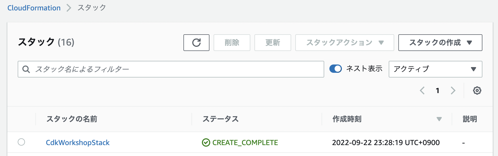
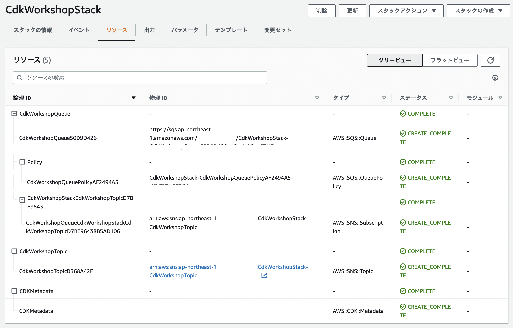

+++
title = "cdk deploy"
weight = 500
+++

CloudFormationテンプレートが作成されました。次は何を行うでしょうか？ **AWSへのデプロイをしましょう！**

## 環境の初期構築

AWS CDKアプリを環境（アカウント/リージョン）に初めてデプロイするときは、Bootstrapスタックを構築する必要があります。
このスタックには、ツールキットの操作に必要なリソースが含まれています。
たとえば、スタックにはデプロイプロセスで使われるCloudformationテンプレートとアセットを保存するために使用されるS3バケットが含まれます。

`cdk bootstrap` コマンドを実行すれば、bootstrapスタックがAWS環境にデプロイされます。

```
cdk bootstrap
```

実行すると以下のように表示されます。

```
 ⏳  Bootstrapping environment aws://999999999999/us-east-1...
...
```

{} 
アクセス拒否エラーとなるときは**AWS CLI**のクレデンシャル情報が[正しく設定](/15-prerequisites/200-account.html)されているか、
[現在のプロファイル](https://docs.aws.amazon.com/cli/latest/userguide/cli-configure-profiles.html)が
CloudFormationの`cloudformation:CreateChangeSet`を実行する権限を持っているか確認してください。
{}

## デプロイしましょう！

`cdk deploy` コマンドを使用することで、CDKアプリをデプロイできます。

```
cdk deploy
```

次のような警告が表示されるはずです。

```text
This deployment will make potentially sensitive changes according to your current security approval level (--require-approval broadening).
Please confirm you intend to make the following modifications:

IAM Statement Changes
┌───┬─────────────────────────┬────────┬─────────────────┬───────────────────────────┬─────────────────────────────────────────────────────────┐
│   │ Resource                │ Effect │ Action          │ Principal                 │ Condition                                               │
├───┼─────────────────────────┼────────┼─────────────────┼───────────────────────────┼─────────────────────────────────────────────────────────┤
│ + │ ${CdkWorkshopQueue.Arn} │ Allow  │ sqs:SendMessage │ Service:sns.amazonaws.com │ "ArnEquals": {                                          │
│   │                         │        │                 │                           │   "aws:SourceArn": "${CdkWorkshopTopic}"                │
│   │                         │        │                 │                           │ }                                                       │
└───┴─────────────────────────┴────────┴─────────────────┴───────────────────────────┴─────────────────────────────────────────────────────────┘
(NOTE: There may be security-related changes not in this list. See https://github.com/aws/aws-cdk/issues/1299)

Do you wish to deploy these changes (y/n)? 
```

これは、アプリのデプロイにはリスクが伴うことを警告しています。
トピックがメッセージをキューに送信できるようにする必要があるため、**y**を入力してスタックをデプロイし、リソースを作成します。

出力は次のようになります。
ACCOUNT-IDはアカウントID、REGIONはアプリを作成したリージョン、STACK-IDはスタックを一意に特定する識別子です。

```
CdkWorkshopStack: deploying...
CdkWorkshopStack: creating CloudFormation changeset...

 ✅  CdkWorkshopStack

✨  Deployment time: 93.21s

Stack ARN:
arn:aws:cloudformation:REGION:ACCOUNT-ID:stack/CdkWorkshopStack/STACK-ID

✨  Total time: 107.65s
```

## CloudFormationコンソール

CDKアプリはAWS CloudFormationを介してデプロイされます。
各CDKスタックはCloudFormationスタックと1：1に対応します。

なので、AWS CloudFormationコンソールでスタックを管理することができます。

[AWS CloudFormationコンソール](https://console.aws.amazon.com/cloudformation/home)を見てみましょう。

次のようなものが表示されるはずです。（表示されない場合、正しいリージョンにいるか確認してください。）



`CdkWorkshopStack` を選択し、**リソース**タブを開けば、リソースの物理IDを確認できます。



# これでコーディングの準備が整いました！
