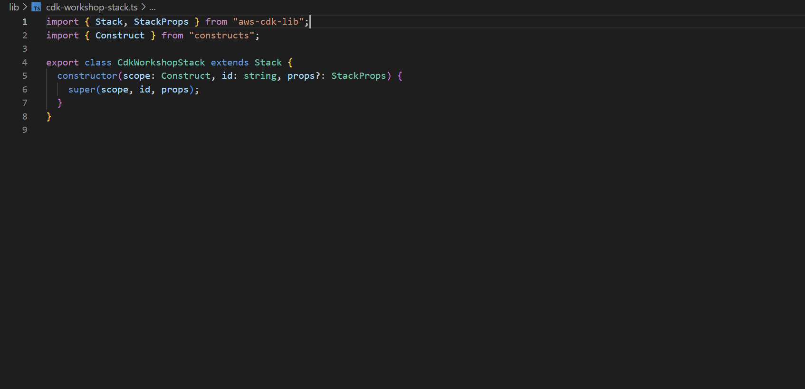
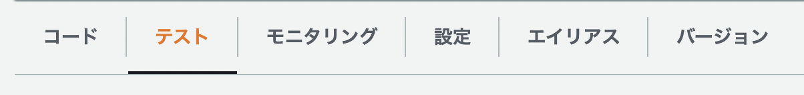
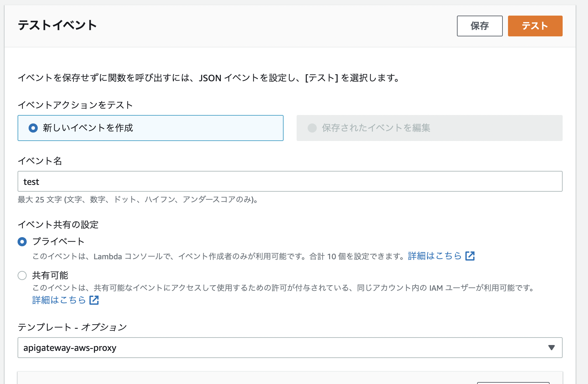

+++
title = "Hello Lambda"
weight = 200
+++

## Lambda handler code

まずは、Lambda handlerのコードから書いていきます。

1. 次のコマンドでLambdaをTypeScriptで記述しやすくするモジュールをインストールします。
   1. `npm install --save-dev esbuild@0 @types/aws-lambda aws-sdk`
2. `cdk-workshop`ディレクトリに`lambda`ディレクトリを作成します。
3. `lambda/hello.ts`というファイルを追加し、以下の内容を記述します。

```ts
export const handler: AWSLambda.APIGatewayProxyHandler = async (event) => {
  console.log("request:", JSON.stringify(event, undefined, 2));
  return {
    statusCode: 200,
    headers: { "Content-Type": "text/plain" },
    body: `Hello, CDK! You've hit ${event.path}\n`
  };
};
```

これは、**「Hello, CDK! You’ve hit [url path]」**というテキストを返す単純なLambda関数です。
HTTPステータスコードとHTTPヘッダーが付加されたHTTPレスポンスとしてユーザーに応答するために、API Gatewayを使用します。

{}
このLambda関数はTypeScriptで実装されていますが、実際のLambda上ではJavaScriptに変換されたコードが動作します。
これは、デプロイ時にはCDKが[esbuild](https://esbuild.github.io/)でJavaScriptにビルドしてくれるためです。
その他の言語での実装については[AWS Lambdaのドキュメント](https://docs.aws.amazon.com/lambda/latest/dg/welcome.html)を参照してください。
{}

## コピー＆ペーストは使わずにコードを書いてみましょう

このワークショップでは、コピー&ペーストをするのではなく、実際にCDKのコードを入力することを強く推奨します（通常、入力する量は多くありません）。
これにより、CDKの使い方についてより理解していただけます。
IDEがオートコンプリート、インラインドキュメント、およびタイプセーフに対応しているのがご理解いただけるでしょう。



## AWS Lambda関数をスタックに追加する

`import`ステートメントを`lib/cdk-workshop-stack.ts`の冒頭に挿入し、`lambda.Function`をスタックに追加します。


import { Stack, StackProps } from 'aws-cdk-lib';
import { Runtime } from 'aws-cdk-lib/aws-lambda';
import { NodejsFunction } from 'aws-cdk-lib/aws-lambda-nodejs';
import { Construct } from 'constructs';

export class CdkWorkshopStack extends Stack {
  constructor(scope: Construct, id: string, props?: StackProps) {
    super(scope, id, props);

    // AWS Lambdaリソースを定義
    const hello = new NodejsFunction(this, 'HelloHandler', {
      runtime: Runtime.NODEJS_16_X, // 実行環境
      entry: 'lambda/hello.ts', // エントリーファイルはhello.ts
    });
  }
}


注目すべきいくつかの点：

- この関数は`NODEJS_16_X`(Nodejs v16.x)ランタイムを使用します。
- ハンドラーコードは、先程作った `lambda` ディレクトリからロードされます。
  パスは、`cdk` コマンドが実行されたディレクトリから相対パスです。

## コンストラクト(constructs) と コンストラクター(constructors) について

ご覧のとおり、`CdkWorkshopStack`と`NodejsFunction`の両方のコンストラクタークラス（およびCDKの他の多くのクラス）は`(scope, id, props)`という同じような引数を受け取ります。
これは、これらのクラスがすべて**コンストラクタ**であるためです。
コンストラクトはCDKアプリの基本的な構成要素です。
それらは「クラウドコンポーネント」を表現します。クラウドコンポーネントはスコープを介してより高いレベルの抽象化に構築できます。
スコープにはコンストラクトを含めることができ、そのコンストラクトには他のコンストラクトなどを含めることができます。

コンストラクトは常に別のコンストラクトのスコープ内で作成され、作成されたスコープ内で一意でなければならない識別子（id）を持っている必要があります。
したがって、コンストラクト初期化子（コンストラクター）には常に次のシグネチャが必要です。

1. **`scope：`** : 最初の引数には、この構成が作成されるスコープを必ず指定します。
   ほとんどすべての場合、現在の コンストラクトスコープ内でコンストラクトを定義することになります。
   つまり、通常最初の引数には`this`を渡すだけです。

2. **`id`** ： 2番目の引数は、構造の**ローカルID**です。
   これは、同じスコープ内のコンストラクト間で一意である必要があるIDです。
   CDKはこのIDを使用して、 このスコープ内で定義された各リソースの[CloudFormation 論理ID](https://docs.aws.amazon.com/AWSCloudFormation/latest/UserGuide/resources-section-structure.html)を計算します。
   *CDKのIDの詳細*については、[CDKユーザーマニュアル](https://docs.aws.amazon.com/cdk/latest/guide/identifiers.html#identifiers_logical_ids)を参照してください。

3. **`props`** : 最後の（場合によっては不要である場合もある）引数は、初期化プロパティのセットです。
   これらは各コンストラクトで固有です。
   たとえば、`NodejsFunction`コンストラクトは`runtime`、`entry`のようなプロパティを受け取ります。
   IDEのオートコンプリートまたは[オンラインドキュメント](https://docs.aws.amazon.com/cdk/api/latest/docs/aws-lambda-readme.html)を使用して、さまざまなオプションを調べられます。

## Diff

コードを保存し、デプロイする前に差分を見てみましょう。

```
cdk diff
```

出力は次のようになります。

```text
Stack CdkWorkshopStack
IAM Statement Changes
┌───┬─────────────────────────────────┬────────┬────────────────┬──────────────────────────────┬───────────┐
│   │ Resource                        │ Effect │ Action         │ Principal                    │ Condition │
├───┼─────────────────────────────────┼────────┼────────────────┼──────────────────────────────┼───────────┤
│ + │ ${HelloHandler/ServiceRole.Arn} │ Allow  │ sts:AssumeRole │ Service:lambda.amazonaws.com │           │
└───┴─────────────────────────────────┴────────┴────────────────┴──────────────────────────────┴───────────┘
IAM Policy Changes
┌───┬─────────────────────────────┬────────────────────────────────────────────────────────────────────────────────┐
│   │ Resource                    │ Managed Policy ARN                                                             │
├───┼─────────────────────────────┼────────────────────────────────────────────────────────────────────────────────┤
│ + │ ${HelloHandler/ServiceRole} │ arn:${AWS::Partition}:iam::aws:policy/service-role/AWSLambdaBasicExecutionRole │
└───┴─────────────────────────────┴────────────────────────────────────────────────────────────────────────────────┘
(NOTE: There may be security-related changes not in this list. See https://github.com/aws/aws-cdk/issues/1299)

Resources
[+] AWS::IAM::Role HelloHandler/ServiceRole HelloHandlerServiceRole11EF7C63 
[+] AWS::Lambda::Function HelloHandler HelloHandler2E4FBA4D 
```

上記のとおり、このコードから **AWS::Lambda::Function** リソース用のCloudFormationテンプレートを生成しました。
また、ツールキットがハンドラーコードの場所を伝達するためにいくつかの[CloudFormationパラメーター](https://docs.aws.amazon.com/cdk/latest/guide/get_cfn_param.html)を利用しています。

## Deploy

次にデプロイをします。

```
cdk deploy
```

`cdk deploy` を実行すると、CloudFormationスタックをデプロイするだけでなく、
初期構築したS3バケットに対して、ローカルの `lambda` ディレクトリを圧縮後、アップロードしていることがが分かるでしょう。

## Lambda関数のテスト

AWS Lambdaコンソールに移動して、Lambda関数をテストしましょう。

1. [AWS Lambdaコンソール](https://console.aws.amazon.com/lambda/home#/functions?fo=and&o0=%3A&v0=CdkWorkshopStack-HelloHandler) を開きます
   （正しいリージョンにいることを確認してください）。

   Lambda関数が表示されます。

   

2. 関数名をクリックして、コンソールを移動します。

3. **テスト**タブをクリックします。

    

5. **イベント名**に`test`を入力します。

4. **テンプレート**リストから**Amazon API Gateway AWS Proxy**を選択します。

    

6. **保存**をクリックします。

7. **テスト**をクリックし、実行が完了するまで待ちます。

8. **実行結果**ペインで**詳細**を展開すると、出力が表示されます。

   

# 👏
