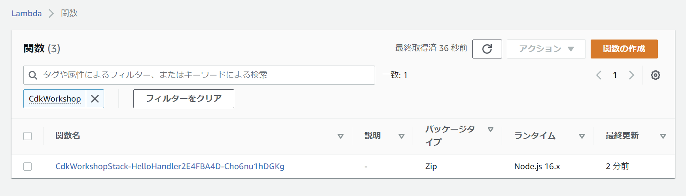
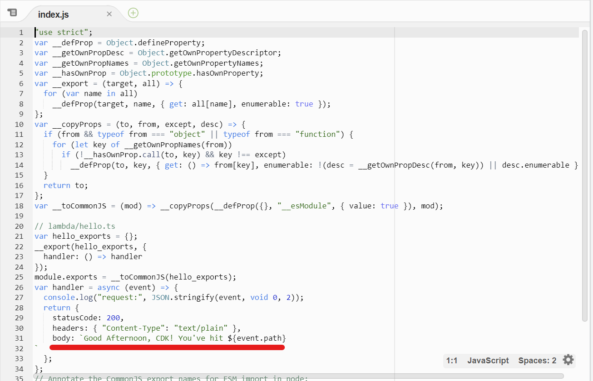

+++
title = "CDK Watch"
weight = 300
+++

## より高速なデプロイ

{}
このセクションはワークショップを完了するために必要ではありませんが、
`cdk deploy --hotswap` と `cdk watch` がどのようにデプロイを高速化するのか見てみましょう。
{}

lambdaが動作するようになりましたね！
しかし、もしlambdaのコードを微調整して正しく動作させたい場合はどうしたらよいでしょうか？
例えば、lambda関数を「`Hello, CDK`」ではなく「`Good Morning, CDK!`」と応答させることに決めたとしましょう。

今のところ、スタックを更新するために使えるツールは `cdk deploy` しかないように思えます。
しかし、`cdk deploy`には時間がかかります。
CloudFormationスタックをデプロイして、`lambda`ディレクトリをbootstrapバケットにアップロードしなければならないからです。
lambdaのコードを変更するだけなら、CloudFormationスタックを更新する必要はないので、`cdk deploy`の部分は無駄な労力となります。

本当に必要なのは、lambdaコードの更新だけなのです。
それだけを行うための他のメカニズムがあれば最高なのですが...。

## `cdk deploy` にかかる時間を測ってみる

まず、`cdk deploy`を実行するのにかかる時間を計ってみましょう。
これは、CloudFormationのフルデプロイにどれくらい時間がかかるかの基準値になります。
そのために、`lambda/hello.js` 内のコードを変更します。


exports.handler = async function(event) {
  console.log("request:", JSON.stringify(event, undefined, 2));
  return {
    statusCode: 200,
    headers: { "Content-Type": "text/plain" },
    body: `Good Morning, CDK! You've hit ${event.path}\n`
  };
};


変更が `cdk deploy` を実行してみましょう。

```
cdk deploy
```

出力は次のようになります。

```
✨  Synthesis time: 6s

CdkWorkshopStack: deploying...
CdkWorkshopStack: creating CloudFormation changeset...


 ✅  CdkWorkshopStack

✨  Deployment time: 66.82s

Stack ARN:
arn:aws:cloudformation:REGION:ACCOUNT-ID:stack/CdkWorkshopStack/STACK-ID

✨  Total time: 72.82s
```

正確な時間にはばらつきがありますが、通常のデプロイにかかる時間については、かなりの目安になるはずです！

## Hotswap deployments

{}
このコマンドは、デプロイを高速化するために、CloudFormationのスタックに意図的にドリフトを発生させるものです。
このため、開発目的にのみ使用してください。
本番デプロイには絶対にhotswapを使わないでください!
{}

`CDK deploy --hotswap` を使えばデプロイ時間を短縮することができます。これはCloudFormation のデプロイの代わりにホットスワップデプロイが実行可能かどうかを評価してくれます。
可能であれば、CDK CLIはAWSサービスAPIを使用して直接変更を行います。そうでない場合は、CloudFormationのフルデプロイメントを実行します。

ここでは、`cdk deploy --hotswap` を使用して、AWS Lambda のアセットコードにホットスワップ可能な変更をデプロイします。

## `cdk deploy --hotswap` にかかる時間を測ってみる

`lambda/hello.js`のlambdaコードをもう一回変えてみましょう。


exports.handler = async function(event) {
  console.log("request:", JSON.stringify(event, undefined, 2));
  return {
    statusCode: 200,
    headers: { "Content-Type": "text/plain" },
    body: `Good Afternoon, CDK! You've hit ${event.path}\n`
  };
};


そして `cdk deploy --hotswap` を実行してみます。

```
cdk deploy --hotswap
```

出力は次のようになります。

```
✨  Synthesis time: 6.44s

⚠️ The --hotswap flag deliberately introduces CloudFormation drift to speed up deployments
⚠️ It should only be used for development - never use it for your production Stacks!

CdkWorkshopStack: deploying...
✨ hotswapping resources:
   ✨ Lambda Function 'CdkWorkshopStack-HelloHandler2E4FBA4D-tEZTcXqG8YYe'
✨ Lambda Function 'CdkWorkshopStack-HelloHandler2E4FBA4D-tEZTcXqG8YYe' hotswapped!

 ✅  CdkWorkshopStack

✨  Deployment time: 3.07s

Stack ARN:
arn:aws:cloudformation:REGION:ACCOUNT-ID:stack/CdkWorkshopStack/STACK-ID

✨  Total time: 9.51s
```

なんと、ホットスワップデプロイは3秒でした。さきほどのフルデプロイは67秒かかりました! 
でも、警告メッセージをよく読んでください。

```
⚠️ The --hotswap flag deliberately introduces CloudFormation drift to speed up deployments
⚠️ It should only be used for development - never use it for your production Stacks!
```

> `--hotswap` フラグは、デプロイメントを高速化するために意図的に CloudFormation のドリフトを導入しています。
> これは開発のみに使用すべきです - 決して本番のStacksには使用しないでください！

## 本当ににデプロイできてる？

Wow that was fast. Did the code actually change? Let's go to the AWS Lambda Console and double check!

高速にデプロイされることが確認できたと思います。
実際にコードは変更されたのでしょうか？
AWS Lambda Consoleで再確認してみましょう!

1. [AWS Lambda Console](https://console.aws.amazon.com/lambda/home#/functions)を開きます。 (正しいリージョンにいることを確認してください)

    デプロイした関数を見つけてください。

    

2. 関数の名前をクリックします。

3. デプロイされたコードが表示されます。変更されていることは確認できましたでしょうか？

    

## CDK Watch

毎回 `cdk deploy` や `cdk deploy --hotswap` を呼び出すよりも、もっと良い方法があるはずです。
`cdk watch` は `cdk deploy` と似ていますが、ワンショットの操作ではなく、
コードやアセットの変更を監視して、変更が検出されたときに自動的にデプロイを実行してくれます。
デフォルトでは、`cdk watch` は `--hotswap` フラグを使用し、変更を検査し、その変更がホットスワップ可能かどうかを決定します。
`cdk watch --no-hotswap`を呼び出すと、ホットスワップの動作が無効化されます。

一度設定すれば、`cdk watch`を使用して、ホットスワップ可能な変更とCloudFormationのフルデプロイを必要とする変更の両方を検出することができます。

## `cdk.json` を編集する

When the `cdk watch` command runs, the files that it observes are determined by the `"watch"` setting in the `cdk.json` file. 
It has two sub-keys, `"include"` and `"exclude"`, each of which can be either a single string or an array of strings.
Each entry is interpreted as a path relative to the location of the `cdk.json` file. 
Globs, both `*` and `**`, are allowed to be used.

Your `cdk.json` file should look similar to this:

`cdk watch` コマンドが実行されると、監視するファイルは `cdk.json` ファイルにある `"watch"` 設定によって決定されます。
この設定には、 `"include"` と `"exclude"` という2つのサブキーがあり、それぞれ単一の文字列または文字列の配列として使用できます。
各エントリーは `cdk.json` ファイルの場所からの相対パスとして解釈されます。
glob、つまり`*` と `**` の両方を使用することができます。

あなたは今、以下のような `cdk.json` ファイルを持っているはずです。

```json
{
  "app": "npx ts-node --prefer-ts-exts bin/cdk-workshop.ts",
  "watch": {
    "include": [
      "**"
    ],
    "exclude": [
      "README.md",
      "cdk*.json",
      "**/*.d.ts",
      "**/*.js",
      "tsconfig.json",
      "package*.json",
      "yarn.lock",
      "node_modules",
      "test"
    ]
  },
  "context": {
    // ...
  }
}
```

見ての通り、このサンプルアプリでは `"watch"` 設定が推奨されています。
実際に `lambda` フォルダにある `.js` ファイルを監視したいので、 `"**/*.js"` を `"exclude"` リストから削除してみましょう。

```json
{
  "app": "npx ts-node --prefer-ts-exts bin/cdk-workshop.ts",
  "watch": {
    "include": [
      "**"
    ],
    "exclude": [
      "README.md",
      "cdk*.json",
      "**/*.d.ts",
      "tsconfig.json",
      "package*.json",
      "yarn.lock",
      "node_modules",
      "test"
    ]
  },
  "context": {
    // ...
  }
}
```

これで`cdk watch`の準備は万端です!

## `cdk watch` にかかる時間を測ってみる

まず `cdk watch` を実行してみます。

```
cdk watch
```

これで初期デプロイが始まり、すぐに `cdk.json` で指定したファイルの観測を開始します。

もう一度、`lambda/hello.js` を変更してみましょう。


exports.handler = async function(event) {
  console.log("request:", JSON.stringify(event, undefined, 2));
  return {
    statusCode: 200,
    headers: { "Content-Type": "text/plain" },
    body: `Good Night, CDK! You've hit ${event.path}\n`
  };
};


Lambda コードファイルの変更を保存すると、`cdk watch` がファイルが変更されたことを認識し、新しいデプロイメントが開始されます。
今回は、lambdaアセットコードをホットスワップできることを認識し、CloudFormation のデプロイを回避して、代わりに Lambda サービスに直接デプロイされます。

デプロイはどれくらいの速度で行われたのでしょうか？

```
Detected change to 'lambda/hello.js' (type: change). Triggering 'cdk deploy'

✨  Synthesis time: 5.57s

⚠️ The --hotswap flag deliberately introduces CloudFormation drift to speed up deployments
⚠️ It should only be used for development - never use it for your production Stacks!

CdkWorkshopStack: deploying...
✨ hotswapping resources:
   ✨ Lambda Function 'CdkWorkshopStack-HelloHandler2E4FBA4D-tEZTcXqG8YYe'
✨ Lambda Function 'CdkWorkshopStack-HelloHandler2E4FBA4D-tEZTcXqG8YYe' hotswapped!

 ✅  CdkWorkshopStack

✨  Deployment time: 2.54s

Stack ARN:
arn:aws:cloudformation:REGION:ACCOUNT-ID:stack/CdkWorkshopStack/STACK-ID

✨  Total time: 8.11s
```

## Wrap Up

このチュートリアルの残りの部分では、`cdk watch`の代わりに`cdk deploy`を使い続けます。
しかし、必要であれば、単に `cdk watch` をオンにしておくこともできます。
もし、完全なデプロイが必要な場合は、`cdk watch` が `cdk deploy` を呼び出します。

`cdk watch` の使用例についての詳細は、[Increasing Development Speed with CDK Watch](https://aws.amazon.com/blogs/developer/increasing-development-speed-with-cdk-watch/)を参照してください。
