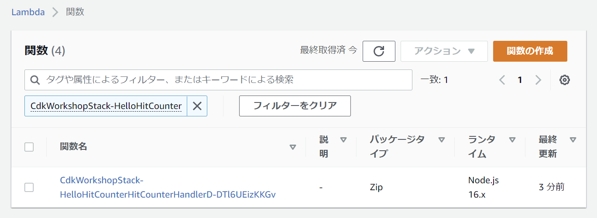
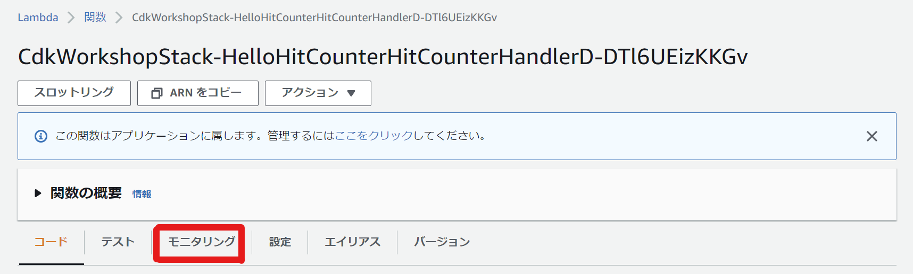
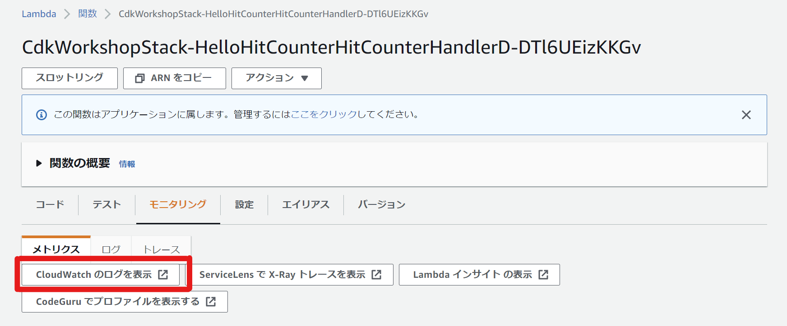

+++
title = "CloudWatch Logs"
weight = 500
+++

## Lambda関数のCloudWatchログを表示する

まず始めに、Lambda関数に実装されているHitCounterのログを確認します。

[SAM CLI](https://github.com/awslabs/aws-sam-cli) や[awslogs](https://github.com/jorgebastida/awslogs) など、
これを行うのに役立つ多くのツールがあります。
このワークショップでは、AWSコンソールからログを見つける方法を紹介します。

1. [AWS Lambdaコンソール](https://console.aws.amazon.com/lambda/home#/functions?fo=and&o0=%3A&v0=CdkWorkshopStack-HelloHitCounter)を開きます
   （東京リージョンに接続されていることを確認してください）。

2. **HitCounter** Lambda関数をクリックします（名前には`CdkWorkshopStack-HelloHitCounter`という文字列が含まれています)

    

3. **モニタリング** をクリックします。

    

4. **CloudWatchのログを表示** をクリックします。これにより、AWS CloudWatchコンソールが開きます。

    

5. 最新のロググループを選択します。

6. 文字列「errorMessage」を含む最新のメッセージを探します。次のようなものが表示されるでしょう。

   ```json
   {
        "errorType": "AccessDeniedException",
        "errorMessage": "User: arn:aws:sts::123456789012:assumed-role/CdkWorkshopStack-HelloHitCounterHitCounterHandlerS-1234567890abc/CdkWorkshopStack-HelloHitCounterHitCounterHandlerD-1234567890ab is not authorized to perform: dynamodb:UpdateItem on resource: arn:aws:dynamodb:ap-northeast-1:123456789012:table/CdkWorkshopStack-HelloHitCounterHits7AAEBF80-1234567890123 because no identity-based policy allows the dynamodb:UpdateItem action",
        "code": "AccessDeniedException",
        "message": "User: arn:aws:sts::123456789012:assumed-role/CdkWorkshopStack-HelloHitCounterHitCounterHandlerS-1234567890abc/CdkWorkshopStack-HelloHitCounterHitCounterHandlerD-1234567890ab is not authorized to perform: dynamodb:UpdateItem on resource: arn:aws:dynamodb:ap-northeast-1:123456789012:table/CdkWorkshopStack-HelloHitCounterHits7AAEBF80-1234567890123 because no identity-based policy allows the dynamodb:UpdateItem action",
        "time": "2022-09-23T14:20:32.823Z",
        "requestId": "V46RBHC7KCRS2NRKP47NFLVQJBVV4KQNSO5AEMVJF66Q9ASUAAJG",
        "statusCode": 400,
        "retryable": false,
        "retryDelay": 30.33595406645787,
        "stack": [
            "AccessDeniedException: User: arn:aws:sts::123456789012:assumed-role/CdkWorkshopStack-HelloHitCounterHitCounterHandlerS-1234567890abc/CdkWorkshopStack-HelloHitCounterHitCounterHandlerD-1234567890ab is not authorized to perform: dynamodb:UpdateItem on resource: arn:aws:dynamodb:ap-northeast-1:123456789012:table/CdkWorkshopStack-HelloHitCounterHits7AAEBF80-1234567890123 because no identity-based policy allows the dynamodb:UpdateItem action",
            "    at Request.extractError (/var/runtime/node_modules/aws-sdk/lib/protocol/json.js:52:27)",
            "    at Request.callListeners (/var/runtime/node_modules/aws-sdk/lib/sequential_executor.js:106:20)",
            "    at Request.emit (/var/runtime/node_modules/aws-sdk/lib/sequential_executor.js:78:10)",
            "    at Request.emit (/var/runtime/node_modules/aws-sdk/lib/request.js:686:14)",
            "    at Request.transition (/var/runtime/node_modules/aws-sdk/lib/request.js:22:10)",
            "    at AcceptorStateMachine.runTo (/var/runtime/node_modules/aws-sdk/lib/state_machine.js:14:12)",
            "    at /var/runtime/node_modules/aws-sdk/lib/state_machine.js:26:10",
            "    at Request.<anonymous> (/var/runtime/node_modules/aws-sdk/lib/request.js:38:9)",
            "    at Request.<anonymous> (/var/runtime/node_modules/aws-sdk/lib/request.js:688:12)",
            "    at Request.callListeners (/var/runtime/node_modules/aws-sdk/lib/sequential_executor.js:116:18)"
        ]
    }
   ```

---

Lambda関数によるDynamoDBテーブルへの書き込みが、権限不足のため失敗していることがわかります。
