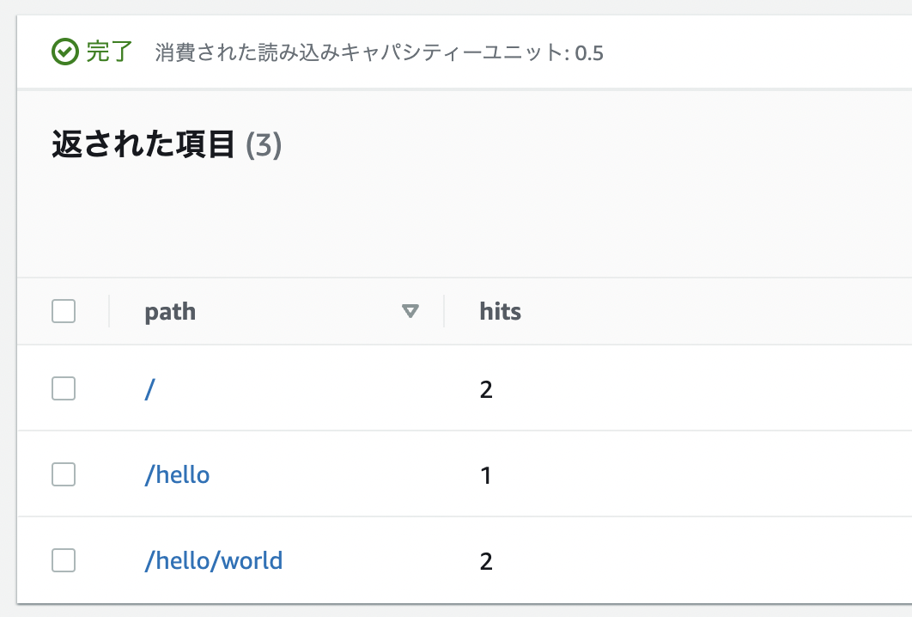

+++
title = "Test the hit counter"
weight = 700
+++

## テスト呼び出し

いくつかのリクエストを実行して、HitCounterが機能するかどうかを確認しましょう。`curl`コマンド、またはWebブラウザから確認ができます。

```
curl https://xxxxxxxxxx.execute-api.us-east-1.amazonaws.com/prod/
curl https://xxxxxxxxxx.execute-api.us-east-1.amazonaws.com/prod/
curl https://xxxxxxxxxx.execute-api.us-east-1.amazonaws.com/prod/hello
curl https://xxxxxxxxxx.execute-api.us-east-1.amazonaws.com/prod/hello/world
curl https://xxxxxxxxxx.execute-api.us-east-1.amazonaws.com/prod/hello/world
```

## DynamoDBコンソールを開く

1. [DynamoDBコンソール](https://console.aws.amazon.com/dynamodb/home)に移動します。
2. テーブルを作成したリージョンにいることを確認してください。手順どおりであれば東京リージョンにいることを確認しましょう。
3. ナビゲーションペインから「テーブル」を選択し、`CdkWorkShopStack-HelloHitCounterHits`で始まるテーブルを選択してください。
4. テーブルを開き、「テーブルアイテムの探索」を選択します。
5. 各パスで取得したヒット数を確認します。

    

6. 新しいパスでAPIを叩き、アイテムビューを更新してください。
   `hits`カウントが1の新しいアイテムが表示されます。

## Good job!

`HitCounter`は大変便利だということがご理解いただけたと思います。
基本的に、誰でもAPI Gatewayのプロキシバックエンドとして機能するLambda関数にアタッチでき、このAPIのカウントを記録できます。

HitCounterはシンプルなJavaScriptクラスであるため、npmモジュールをパッケージ化して、
JavaScriptパッケージマネージャーである[npmjs.org](http://npmjs.org/)に公開できます。
公開後は誰でも`npm install` でインストールでき、CDKアプリに追加できます。

-----

次の章ではnpmに公開されたコンストラクトライブラリを使用します。
このライブラリを使うことでHitCounterテーブルの内容をブラウザに表示することができます。
