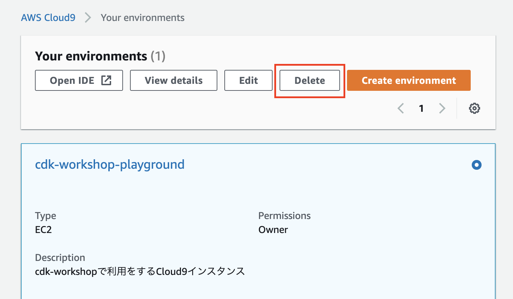
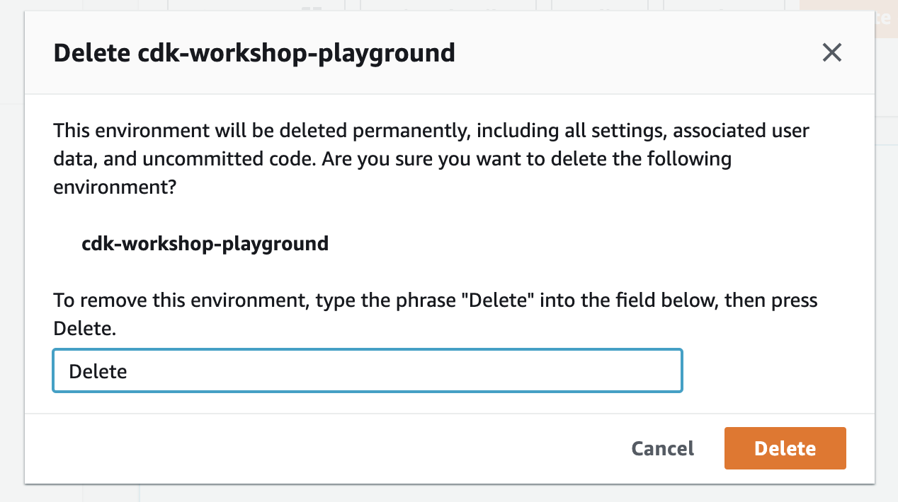

+++
title = "Clean up"
weight = 60
chapter = true
+++

# リソースのクリーンアップ

## スタックのクリーンアップ

スタックを破棄するとき、リソースはその削除ポリシーに従って「削除」、「保持」、「スナップショット」のいずれかで処理されます。
デフォルトでは、ほとんどのリソースはスタック削除時に削除されますが、すべてのリソースがそうなるわけではありません。
DynamoDBのテーブルは、デフォルトで保持されます。このテーブルを保持したくない場合は、CDKのコードで `RemovalPolicy` を使って設定ができます。
今回はクリーンアップを簡単にするため、DynamoDBのテーブル作成時に`RemovalPolicy.DESTROY`を指定しています。
そのためスタックを破棄するだけでテーブルもあわせて削除されます。

また、作成されたLambda関数は、永久に保持されるCloudWatchのログを生成します。
これらは**スタックの一部ではないので、CloudFormationでは追跡されず、ログは削除されずに残ります**。
**CloudWatchのログを削除する場合は、コンソールでこれらを手動で削除する必要**があります。

どのリソースが削除されるかがわかったので、スタックの削除を進めましょう。
CloudFormationのコンソールからスタックを削除するか、`cdk destroy`を使用するかのどちらかです。

```
cdk destroy
```

以下のように聞かれるはずです。

```
Are you sure you want to delete: CdkWorkshopStack (y/n)?
```

`y`を押すと、スタックが削除されていく進捗が表示されます。

`cdk bootstrap` によって作成されたブートストラップスタックは削除されません。
**将来的にCDKを使う予定がある場合は、このスタックを削除しないでください**。

`cdk bootstrap` によって作成されたスタックを削除したい場合は、CloudFormationコンソールから行う必要があります。
CloudFormationコンソールから`CDKToolkit`スタックを削除してください。
作成されたS3バケットは、デフォルトで保持されます。
予期せぬ課金を避けたい場合はS3コンソールから、ブートストラップで生成されたバケットを空にして、削除しておいてください。

## Cloud9 のクリーンアップ

CDK の実行環境として使用した Cloud 9 を削除します。AWS マネージメントコンソールから Cloud 9 を開いて、「Delete」ボタンを押します。



確認画面で「Delete」と入力すると削除できます。


